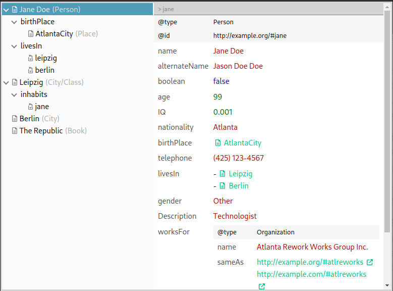

# JSON-LD Browser

Simple [JSON-LD](https://json-ld.org/) Browser. Realizes a treeview browser and details viewer to offer interactive user friendly browsing and viewing through JSON-LD data.



## Project Setup

```sh
npm install
```

### Compile and Hot-Reload for Development

```sh
npm run dev
```
<!--
### Compile and Minify for Production

```sh
npm run build
``` -->


### TODO / Tasks

- online demo (upload and view local JSON-LD files)
- may view/integrate @context/@raph
- order properties in details view (label/name, descr, ... , edges)
- Modes: code mode (view JSON-LD code), editor mode
- test very big json data -> vertical browser max width